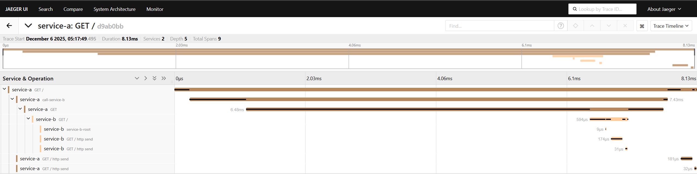

# Архитектурное решение по трейсингу

## 1. Системы и точки, которые нужно покрыть трейсингом

### 1.1. Контейнеры / сервисы

Трейсингом должны быть покрыты все компоненты, которые участвуют в жизненном цикле заказа и могут его «сломать» или задержать:

1. **Internet Shop (фронтенд + Shop API)**

    * создание заказа (INITIATED, FILE_UPLOADED, SUBMITTED);
    * отправка 3D-модели и метаданных в 3D files storage;
    * вызовы MES API / постановка сообщений в RabbitMQ.

2. **CRM (фронтенд + CRM API)**

    * обработка событий по заказу;
    * изменение статусов MANUFACTURING_APPROVED, CLOSED;
    * прием заказов от внешних API (через очередь).

3. **MES (фронтенд + MES API + MES backend)**

    * расчёт стоимости (PRICE_CALCULATED);
    * назначения заказов операторам;
    * статусы MANUFACTURING_STARTED / COMPLETED / PACKAGING / SHIPPED.

4. **Message Queue (RabbitMQ)**

    * публикация и потребление событий: создание заказа, изменение статуса, результат расчёта цены;
    * dead-letter очереди.

5. **Базы данных (Shop DB, MES DB, CRM DB)**

    * операции по записи/чтению заказов и статусов как внутренние спаны внутри API.

6. **3d files storage (S3-подобное хранилище)**

    * загрузка / чтение 3D-файлов, ошибки доступа и таймауты.

### 1.2. Ключевые места, где заказ может «сломаться» или зависнуть

1. **После SUBMITTED в интернет-магазине**

    * заказ создан в Shop DB, но событие в RabbitMQ не отправлено или не доставлено.

2. **На этапе расчёта стоимости в MES**

    * сообщение дошло до MES, но джоба расчёта зависла;
    * результат PRICE_CALCULATED не отправлен обратно в очередь.

3. **При подтверждении производства в CRM**

    * CRM не получила событие о цене / не записала MANUFACTURING_APPROVED;
    * ошибка валидации/логики, из-за которой заказ остаётся в промежуточном состоянии.

4. **На стороне операторов MES**

    * заказ не попал в список операторов (не создалась запись в MES DB, сообщение не обработано);
    * статус MANUFACTURING_STARTED / COMPLETED не сохранился или не ушёл в CRM.

5. **При интеграции через внешний API**

    * MES посчитала цену, но CRM не создала заказ;
    * внешнему партнёру вернулся успех, но внутри цепочки заказ «утонул».

Во всех этих местах должны быть спаны/трейсы, связанные единым trace_id и понятным бизнес-идентификатором заказа.

---

## 2. Список данных, которые должны попадать в трейсинг

В каждый спан/трейс должны попадать следующие данные (как теги/атрибуты):

**Общие атрибуты:**

* `trace_id`, `span_id`, `parent_span_id`
* `service.name` (shop-api, crm-api, mes-api, mes-worker, etc.)
* `operation.name` (CreateOrder, CalculatePrice, ApproveManufacturing, ConsumeOrderCreatedEvent, …)
* `timestamp_start`, `duration_ms`
* `status` (OK / ERROR) + `error.message`, `error.type` (если есть)

**Бизнес-атрибуты:**

* `order_id` — обязательный ключ
* `order_status_before`, `order_status_after`
* `customer_type` (B2C / B2B_API)
* `api_user_id` (для партнёрских клиентов)
* `operator_id` (для операций в MES)
* `3d_model_complexity` (например, количество полигонов / размер файла)

**Сообщения и очереди (RabbitMQ):**

* `queue_name` / `routing_key`
* `message_id`, `correlation_id`
* `delivery_attempt` (номер попытки)
* `dlq` = true/false (признак попадания в DLQ)

**Интеграции и БД:**

* `db.operation` (SELECT / INSERT / UPDATE)
* `db.statement` (укороченная форма, без параметров с персональными данными)
* `http.method`, `http.route`, `http.status_code`
* `external_system` (3d_storage, transport_company_api, etc.)

---

## 3. Мотивация

### 3.1. Зачем системе нужен трейсинг

Сейчас компания видит только конечный результат: «заказ не дошёл», «MES тормозит», «клиент ждёт уже несколько месяцев». Не видно, **на каком именно шаге** цепочки всё сломалось: HTTP-запрос, очередь, расчёт цены, запись в БД или CRM.

Трейсинг даёт:

* **Сквозную картину пути заказа**: от нажатия пользователем кнопки «Сделать заказ» до SHIPPED/CLOSED.
* Возможность быстро определить «узкое место» или точку потери сообщений.
* Инструмент для анализа производительности по шагам, а не «в среднем по системе».
* Возможность опираться на цифры при диалоге с бизнесом: «на 5% заказов мы теряем событие PRICE_CALCULATED», «95% времени заказ проводит в ожидании MANUFACTURING_APPROVED».

### 3.2. Метрики, на которые повлияет трейсинг

**Технические:**

1. **MTTD (mean time to detect)** — среднее время обнаружения инцидента.
   Трейсы позволяют увидеть хвост зависших заказов и повышенные ошибки до жалоб клиентов.

2. **MTTR (mean time to recovery)** — среднее время восстановления.
   Отпадает необходимость вручную «пробивать» логи и БД: по trace_id видно, где обрыв.

3. **Время прохождения ключевых этапов**

    * SUBMITTED → PRICE_CALCULATED
    * MANUFACTURING_APPROVED → MANUFACTURING_STARTED
    * MANUFACTURING_STARTED → SHIPPED

4. **Процент «битых» цепочек** (traces with missing expected span)
   → индикатор потери сообщений или ошибок в бизнес-логике.

**Бизнес-метрики:**

1. **Доля просроченных заказов** — уменьшается за счёт быстрого обнаружения проблемных мест.
2. **Доля заказов без корректного статуса** — снижается за счёт контроля корректного завершения цепочки.
3. **Удержание B2B-клиентов** — меньше ситуаций «мы не получили заказ».

---

## 4. Предлагаемое решение

### 4.1. Подход и технологии

**Выбор:** использовать стек **OpenTelemetry** + система просмотра трасс (Jaeger или Grafana Tempo/Tempo+Grafana).

Компоненты:

1. **OpenTelemetry SDK/агенты**

    * для Java-сервисов (Shop API, CRM API) — Java agent / библиотека;
    * для C# MES API — OpenTelemetry .NET SDK;
    * для фоновых воркеров MES (расчёт цены, обработка очереди);
    * для RabbitMQ-клиентов (producer/consumer) во всех сервисах.

2. **OpenTelemetry Collector (новый контейнер)**

    * принимает OTLP-трейсы от всех сервисов;
    * экспортирует их в хранилище трасс.

3. **Хранилище и UI для трейсинга (новый контейнер)**

    * Jaeger / Grafana Tempo: хранение и поиск трасс;
    * UI для разработчиков, поддержки и администраторов.

4. **Интеграция с логами и метриками**

    * trace_id включается в логи, чтобы связать логи и трейс;
    * из трейсинга собираются агрегированные метрики (через OpenTelemetry Collector → Prometheus).

### 4.2. Реализация на уровне сервисов

**Shop API / CRM API (Spring Boot, Java)**

* Подключить OpenTelemetry Java Agent (минимум усилий, auto-instrumentation HTTP, JDBC, RabbitMQ).
* Добавить бизнес-атрибуты `order_id`, `order_status_before/after`, `customer_type`, `api_user_id`.
* При отправке сообщений в RabbitMQ — передавать **W3C tracecontext** (`traceparent`, `tracestate`) в headers + `order_id` как отдельный header.

**MES API / MES backend (C#)**

* Подключить OpenTelemetry .NET SDK (HTTP server, HTTP client, RabbitMQ client, БД).
* Для расчёта цены: отдельный span `CalculatePrice` со свойством `3d_model_complexity` и `duration_ms`.
* При обновлении статусов MANUFACTURING_* и SHIPPED — отдельные спаны с `order_status_before/after` и `operator_id`.

**RabbitMQ**

* Оснастить все consumers трейсингом: span на получение и обработку сообщения.
* Для DLQ — отдельный consumer, который пишет в трейс с тегом `dlq=true`.
* Correlation_id и message_id — атрибуты span’а.

**Фронтенд (опционально)**

* Генерировать `X-Request-ID` и/или использовать `traceparent` от браузера;
* Прокидывать в backend для связи пользовательского действия с серверным трейсом (минимум — для кнопки «Сделать заказ» и формирования итогового трейсинга по заказу).

### 4.3. Обновление C4-диаграммы (красные элементы)

**Ссылку на диаграмму:** [jewerly_c4_model.drawio](jewerly_c4_model.drawio)

---

## 5. Компромиссы

1. **Нагрузка и стоимость хранения**

    * Полный трейсинг всех запросов может быть дорогим по объёму данных.
    * Решение: включить sampling (например, 10% всех запросов + 100% для запросов с ошибками/долгой длительностью; 100% для всех операций с заказами).

2. **Сложность внедрения в проприетарные / старые части MES**

    * Если есть устаревшие компоненты или сторонние библиотеки без доступного кода, трейсинг будет ограниченным.
    * Решение: оборачивать их в «фасад» с трейсингом, но это требует времени.

3. **Нагрузка на сервисы при auto-instrumentation**

    * Дополнительные вычисления и отправка трасс создают нагрузку.
    * Решение: аккуратно настроить sampling, буферизацию и асинхронную отправку.

4. **Человеческий фактор**

    * Чтобы трейсинг приносил пользу, разработчики и поддержка должны им пользоваться и правильно добавлять бизнес-атрибуты.
    * Потребуется обучение и гайды по оформлению спанов.

---

## 6. Безопасность

Трейсинг потенциально содержит чувствительные данные (order_id, customer_id, данные о партнёрах). Поэтому:

1. **Аутентификация и авторизация в UI трейсинга**

    * Доступ только по корпоративной учётке (SSO / OAuth2 / LDAP)
    * Роли:

        * *Support* — чтение трасс;
        * *Developer* — чтение + технические поля;
        * *Admin* — управление retention, sampling и конфигурацией.

2. **Сетевые ограничения**

    * Tracing Storage и Collector доступны только из приватной сети (VPC) компании;
    * доступ снаружи только через VPN/бастион.

3. **Минимизация данных**

    * В трейсах не должны передаваться: ФИО, телефоны, адреса, реквизиты;
    * вместо этого — ссылки на записи в БД (IDs).
    * Укороченные SQL-запросы без конкретных значений параметров.

4. **Шифрование**

    * Шифрование трафика до Collector (TLS, если доступ через внешние сети);
    * хранение данных трейсинга на зашифрованных дисках (поддержка облака).

5. **Retention и анонимизация**

    * Ограниченный срок хранения трасс (например, 30–90 дней);
    * по истечении срока — автоматическое удаление.

---

## 7. Дополнительно: автоматический мониторинг и алертинг на основе трейсинга

### 7.1. Идея

Использовать данные трейсинга для автоматического контроля прохождения заказа через ключевые статусы и автоматического алертинга, если:

* Заказ слишком долго «застрял» на каком-то этапе;
* Отсутствует один или несколько ожидаемых спанов (например, есть SUBMITTED, но нет PRICE_CALCULATED за заданное время);
* Увеличилась доля неуспешных/обрывочных трасс.

### 7.2. Реализация

1. **Экспорт метрик из трейсинга**

    * OpenTelemetry Collector агрегирует трассы в метрики:

        * `order_flow_duration{submitted→price_calculated}` p95;
        * `orders_stuck_in_status{status="PRICE_CALCULATED"}`;
        * `broken_traces_ratio` (есть SUBMITTED, нет SHIPPED/CLOSED за N часов).

2. **Prometheus + Alertmanager / Grafana Alerting**

    * Настроить правила:

        * если `orders_stuck_in_status{status="PRICE_CALCULATED"} > X` в течение 15 минут → алерт в канал поддержки;
        * если p95 `order_flow_duration{submitted→price_calculated} > 20 минут` → инцидент в on-call;
        * если `broken_traces_ratio > 1%` → расследование интеграций.

3. **Интеграция с существующим мониторингом**

    * Алерты по трейсинговым метрикам добавляются к уже существующим по RED/USE;
    * в описании алерта указывается пример trace_id, по которому можно открыть конкретный пример проблемного заказа.

### 7.3. Обновление диаграммы (зелёные элементы)

**Ссылка на диаграмму с мониторингом на основе трейсинга:** [jewerly_c4_model.drawio](jewerly_c4_model.drawio)

---

# 3.1 Jaeger

